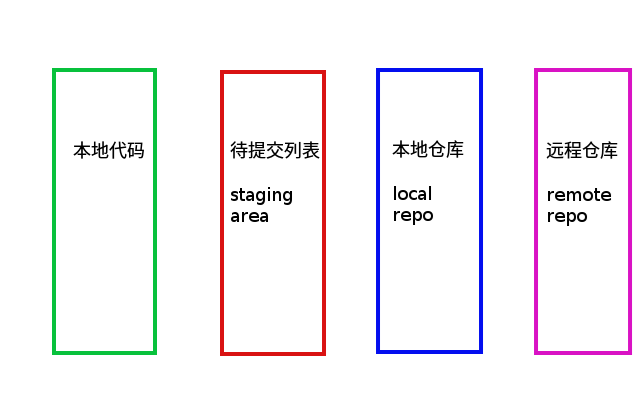
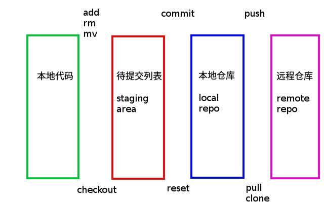

#  git 培训  

一. 安装及基本配置
-
	# 服务端 创建远程仓库
    # 1. 安装并创建git用户
    [root@c000 ~]# yum install -y git1
    [root@c000 ~]# git --version
    git version 1.8.3.1
    2服务器端创建 git 用户，用来管理 Git 服务，并为 git 用户设置密码
    [root@c000 ~]# id git1
    id: git: no such user
    [root@c000 ~]# useradd git1
    [root@c000 ~]# passwd git1
    更改用户 git 的密码
    新的 密码：
    无效的密码： 密码少于 8 个字符
    重新输入新的 密码：
    passwd：所有的身份验证令牌已经成功更新。
	
	# 2. 服务器端创建 Git 仓库
	登录git1用户
	[root@c000 ~]#su - git1
    设置 /home/git1/repository/project.git为 Git 仓库
	[git1@c000 ~/repository]$mkdir -p /home/git1/repository/project.git
	[git1@c000 ~/repository]$ll
    总用量 0
    drwxrwxr-x. 2 git1 git1 6 3月   5 09:46 project.git

	# 3.初始化空的 Git 版本库
    [git1@c000 ~/repository]$git init --bare /home/git1/repository/project.git/   
	[git1@c000 ~/repository/project.git]$ll
    总用量 12
    drwxrwxr-x. 2 git1 git1   6 3月   5 09:54 branches
    -rw-rw-r--. 1 git1 git1  66 3月   5 09:54 config
    -rw-rw-r--. 1 git1 git1  73 3月   5 09:54 description
    -rw-rw-r--. 1 git1 git1  23 3月   5 09:54 HEAD
    drwxrwxr-x. 2 git1 git1 242 3月   5 09:54 hooks
    drwxrwxr-x. 2 git1 git1  21 3月   5 09:54 info
    drwxrwxr-x. 4 git1 git1  30 3月   5 09:54 objects
    drwxrwxr-x. 4 git1 git1  31 3月   5 09:54 refs
    
> 1.git init 创建本地仓库(在工程目录下创建)  
2.git init --bare 创建远端仓库（在服务器或者工程目录以外路径都可以创建的备份仓库）
工程commit到1中，push到2中；

	# 3. 客户端clone
    安装
	验证
	鼠标右击如果看到有两个git单词则安装成功	
	Git GUI Here
	Git Bash Here

    # 4、Git初始化
    
    1、Git安装之后需要进行一些基本信息设置
      　a、设置用户名：   git config -- global  user.name  '你再github上注册的用户名';
    　　b、设置用户邮箱： git config -- global  user.email  '注册时候的邮箱';   
    注意：该配置会在github主页上显示谁提交了该文件
    　　c、配置ok之后，我们用如下命令来看看是否配置成功
     　　git config --list
    注意：git  config --global 参数，有了这个参数表示你这台机器上所有的git仓库都会使用这个配置，当然你也可以对某个仓库指定不同的用户名和邮箱
	
    username@hostname MINGW64 /d/git/repository  
    $ git config --list  
    core.symlinks=false  
    core.autocrlf=true  
    color.diff=auto  
    color.status=auto  
    color.branch=auto  
    color.interactive=true  
    pack.packsizelimit=2g  
    help.format=html  
    http.sslcainfo=C:/Program Files/Git/mingw64/ssl/certs/ca-bundle.crt  
    diff.astextplain.textconv=astextplain  
    rebase.autosquash=true  
    user.name=zhaoqingfu  
    user.email=fhqydp@163.com  
	
	全局配置文件
	c:\Users\username\.gitconfig
	[user]
	name = zhaoqingfu
	email = fhqydp@163.com
	
	本地目录配置
	~/.git/config

	username@hostname MINGW64 /d/git/repository/project/.git (GIT_DIR!)
	$ cat config

	[core]
	        repositoryformatversion = 0
	        filemode = false
	        bare = false
	        logallrefupdates = true
	        symlinks = false
	        ignorecase = true
	        hideDotFiles = dotGitOnly
	[remote "origin"]
	        url = git1@IP:/home/git1/repository/project.git
	        fetch = +refs/heads/*:refs/remotes/origin/*
	[branch "master"]
	        remote = origin
	        merge = refs/heads/master

	username@hostname MINGW64 /d/git/repository/project/.git (GIT_DIR!)
	$ ll
	total 7
	-rw-r--r-- 1 username None 344 三月  5 03:07 config
	-rw-r--r-- 1 username None  73 三月  5 03:06 description
	-rw-r--r-- 1 username None  23 三月  5 03:06 HEAD
	drwxr-xr-x 1 username None   0 三月  5 03:06 hooks/
	drwxr-xr-x 1 username None   0 三月  5 03:06 info/
	drwxr-xr-x 1 username None   0 三月  5 03:06 objects/
	drwxr-xr-x 1 username None   0 三月  5 03:06 refs/

	# 5. clone
	username@hostname MINGW64 /d/git/repository
	$ git clone git1@IP:/home/git1/repository/project.git
	Cloning into 'project'...
	warning: You appear to have cloned an empty repository.
	Checking connectivity... done.
	
	username@hostname MINGW64 /d/git/repository
	$ ll
	total 0
	drwxr-xr-x 1 username None 0 三月  5 04:40 project/

	$ cat config
	[core]
	        repositoryformatversion = 0
	        filemode = false
	        bare = false
	        logallrefupdates = true
	        symlinks = false
	        ignorecase = true
	        hideDotFiles = dotGitOnly
	[remote "origin"]
	        url = git1@IP:/home/git1/repository/project.git
	        fetch = +refs/heads/*:refs/remotes/origin/*
	[branch "master"]
	        remote = origin
	        merge = refs/heads/master

	# 6. 免密
	客户端创建 SSH 公钥和私钥
	C:\Users\username\.ssh
	username@hostname MINGW64 /d/git/www/gittest_gitbash
	Git Bash端
	$ ssh-keygen -t rsa -C "fhqydp@163.com"
	Generating public/private rsa key pair.
	Enter file in which to save the key (/c/Users/username/.ssh/id_rsa):
	/c/Users/username/.ssh/id_rsa already exists.
	Overwrite (y/n)?

	# 服务器
	[git1@c000 ~]$mkdir -p /home/git1/.ssh
	# 客户端
	GIT bash端上传
	username@hostname MINGW64 ~
	$ cd
	
	username@hostname MINGW64 ~
	$ pwd
	/c/Users/username
	
	username@hostname MINGW64 ~
	$ ssh git1@IP 'cat >> .ssh/authorized_keys' <~/.ssh/id_rsa.pub
	git1@IP's password:

	username@hostname MINGW64 ~
	$
	 
	# 服务器
	
	[git1@c000 ~]$pwd
	/home/git1
	[git1@c000 ~]$chmod 700 .ssh/

	[git1@c000 ~]$cd .ssh/
	[git1@c000 ~/.ssh]$chmod 600 authorized_keys 

> 重要：
> 	修改 .ssh 目录的权限为 700  
> 	修改 .ssh/authorized_keys 文件的权限为 600  
	
	# 测试免密clone
	username@hostname MINGW64 /d/git/repository
	$ git clone git@IP:/home/git1/repository/project.git
	Cloning into 'project'...
	fatal: '/home/git1/repository/project.git' does not appear to be a git repository
	fatal: Could not read from remote repository.
	
	Please make sure you have the correct access rights
	and the repository exists.

	禁止 git 用户 ssh 登录服务器
	$ /etc/passwd
	找到：
	username:x:1000:1000:username:/home/username:/bin/bash
	git:x:1001:1001::/home/git:/bin/bash
	git1:x:1002:1002::/home/git1:/bin/bash

	修改为
	username:x:1000:1000:username:/home/username:/bin/bash
	git:x:1001:1001::/home/git:/bin/git-shell
	git1:x:1002:1002::/home/git1:/bin/git-shell
二. 基本操作
-
### 四大位置(工作区 暂存区 版本库 远程库) :
  
### 流转过程:
  
 	
	基本流转
	1. 克隆 clone (push)
	$ git clone git1@IP:/home/git1/repository/project.git

	2. 查看状态
	$ git status
	
	3. 增加到工作区
	$ touch work
	
	4. 增加到暂存区
	$ git add work
	
	5. 提交到本地仓库
	$ git commit -m "work" work
	
	6. 上传到远程仓库 
	$ git push origin master

	撤销
	1. 从工作区撤销
	$ git checkout -- work
	
	2. 从暂存区撤销
	暂存区:git reset work

	3. 从本地仓库撤销
	仓库区:git reset -- hard head^
	
	版本回退
	1. 查看历史版本
	$ git log
	简化形式
	$ git log --pretty=oneline
	
	2. 撤销到上一版本 （Head是当前版本）
	$ git reset --hard head^
	$ git reset --hard head^^
	$ git reset --hard head~100
	3. 指定版本：
	查看以前的操作版本
	$ git reflog
	撤销
	$ git reset --hard 2c9d
	
	小技巧:
	忽略文件
	创建.gitignore文件
	$ ll -altrh
	drwxr-xr-x 1 username None  0 三月  5 08:46 .git/
	-rw-r--r-- 1 username None  0 三月  5 09:33 .gitignore
	*.yarml

	clone与push区别
	clone 是本地没有 repository 时，将远程 repository 整个下载过来。
	pull 是本地有 repository 时，将远程 repository 里新的 commit 数据(如有的话)下载过来，并且与本地代码merge。

三. 仓库
-
	1. 查看仓库(简称)
       $ git remote
    	对应的克隆地址
	   $ git remote -v
		查看某个仓库
	   $ git remote show origin

	2. 创建远程仓库: 
	   $ git init --bare 
	   创建本地仓库
       $ git init
	
	3. 增加到远程仓库
	$ git remote add [shortname] [url]
	$ git remote add origin 用户名@IP:/path/*.git
	
	4. 拉取
	    拉取全部	
		$ git clone 用户名@IP:/path/*.git
		拉取新增的并自己合并
		$ git pull [remote-name] 
		拉取新增后自己到合并
		$ git fetch [remote-name]  
	5. 推送数据

		$ git push origin master
	    $ git push <远程主机名> <本地分支名>:<远程主机分支名>

	6. 修改
	$ git remote rename [原名称] [新名称]
	
	7. 删除 
	git remote rm origin

	
四. 分支管理
-
	1. 查看分支
	$ git branch

	2. 创建+切换分支
	$ git checkout –b name

	3. 创建分支
	$ git branch name

	4. 切换分支
	$ git checkout name

	5. 合并某分支到当前分支
	禁用快速模式
	$ git merge –no-ff -m ""
	”Fast forward”模式丢掉分支信息
	$ git merge name
	
	6. 删除分支
	$ git branch –d name
    删除远程分支
	$ git push origin --delete dev 

	7. bug分支: 
	保留现场: 
	$ git stash 
	查看现场
	$ git stash list
	恢复并删除
	$ git stash pop
	恢复
	$ git stash apply
	删除
	$ git stash drop
	
	8. 多人协作:
	冲突先push: git push
	指定本地dev分支与远程origin/dev分支的链接:  
    git branch --set-upstream dev orgin/dev
	解决冲突,push
	git push orgin dev
    查看冲突
	$ git diff name

五. git 的分支整体预览
-

从上图可以看到主要包含下面几个分支：
> 
> master: 主分支，主要用来版本发布。
> develop：日常开发分支，该分支正常保存了开发的最新代码。  
> feature：具体的功能开发分支，只与 develop 分支交互。  
> release：release 分支可以认为是 master 分支的未测试版。比如说某一期的功能全部开发完成，那么就将 develop 分支合并到 release 分支，测试没有问题并且到了发布日期就合并到 master 分支，进行发布。  
> hotfix：线上 bug 修复分支。  